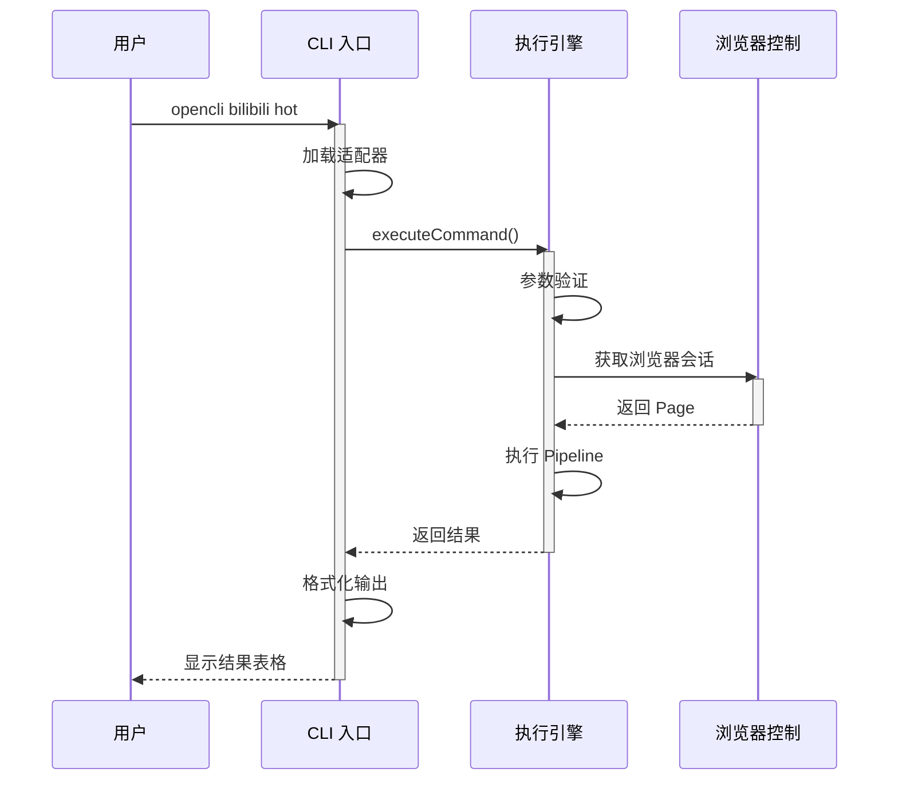

# [仓库名称] - 架构与拓扑梳理文档

> **💡 Agent 生成指令**：
> 1. 本文档必须结合《产品与业务上下文解析》进行生成。
> 2. 凡要求使用 `plainText` 的地方，必须使用纯文本 ASCII 字符（如 `+---+`, `--->`）绘制结构图，严禁使用 Mermaid 或 Markdown List 代替。
> 3. 数据流部分必须且仅能使用 `Mermaid` 的 `sequenceDiagram`。
> 4. 接口与契约必须遵循 OpenSpec 标准或严格的 TypeScript 接口类型定义。

---

## ASCII 图绘制最佳实践

### 1. 整体架构设计 (Overall Architecture)

* **架构概述**：[文字说明：简述系统整体采用了什么架构模式（如分层架构、微服务、插件化），各层的核心职责是什么。]

* **整体架构图 (plainText)**：

**绘制规范**：
- 使用 `+`、`-`、`|` 绘制边框
- 使用 `>`、`<`、`v`、`^` 绘制箭头
- 使用 `=` 绘制双线边框（用于强调）
- 每层之间保留空行
- 模块名居中对齐
- 箭头方向一致（通常从上到下或从左到右）

**示例**：
```text
+---------------------------------------------+
|           用户界面层 (UI Layer)             |
|  [React Components]  ↔  [State Management] |
+------------------+--------------------------+
                   | (HTTP/REST)
                   v
+---------------------------------------------+
|           API 网关层 (API Gateway)          |
|  [Auth] → [Rate Limiter] → [Router]       |
+------------------+--------------------------+
                   |
                   v
+---------------------------------------------+
|           核心服务层 (Core Services)        |
|  +-------------+  +-------------+          |
|  | User Module |  | Task Engine |          |
|  +-------------+  +-------------+          |
+---------------------------------------------+
                   |
                   v
+---------------------------------------------+
|       基础设施层 (Infrastructure)             |
|  [PostgreSQL]  ↔  [Redis Cache]          |
+---------------------------------------------+
```

---

## 2. 模块依赖与调用关系 (Dependencies & Routing)

### 2.1 全局入口与核心路由

- **逻辑说明**：[文字说明：描述请求是如何从入口文件进入，经过路由分发器，最终到达对应业务模块的。]

- **调用拓扑 (plainText)**：

**绘制规范**：
- 使用 `+-->` 表示调用关系
- 使用空格缩进表示层次
- 关键节点用 [] 或 () 包裹说明

**示例**：
```text
main.ts (Bootstrap)
 +-- app.module.ts (Root)
      |
      +---> /api/v1/auth ---> AuthController ---> AuthService
      |
      +---> /api/v1/tasks --> TaskController ---> TaskRunnerService
                                                  +---> LLMProvider
```

---

### 2.2 核心业务实体与关联

- **实体定义**：[文字说明：列出核心实体（如 User, Workspace, PromptTemplate），说明它们在业务中的流转含义。]

- **实体引用拓扑 (plainText)**：

**绘制规范**：
- 使用 `1 ---> N` 表示一对多关系
- 使用 `1 <---> 1` 表示一对一关系
- 清晰的层次结构

**示例**：
```text
[User] 1 -----> N [Workspace]
                     |
                     +-- 1 -----> N [Task]
                                     |
                                     +-- 1 -----> 1 [PromptTemplate]
```

---

## 核心模块设计 (Core Module Design)

### 模块一：[模块名称]

- **模块名称**：[选定最核心的 4-5 个模块，例如：Task Engine]
- **设计说明**：[文字说明：该模块内部是如何设计的？使用了哪些设计模式（如工厂模式、策略模式）？]
- **内部结构图 (plainText)**：

**绘制规范**：
- 清晰的模块边界
- 关键组件用 +---+ 边框
- 数据流向用箭头表示

**示例**：
```text
+-------------------+       +-----------------------+
| TaskQueueManager  | ----> |   WorkerDispatcher    |
+-------------------+       +-----------+-----------+
                                    |
                        +-----------v-----------+
                        | Execution Strategies  |
                        | - NodeRunner          |
                        | - PythonSandbox       |
                        +-----------------------+
```

---

### 模块二：[模块名称]

[同上格式...]

---

## 核心数据流时序 (Core Data Flow)

### 场景说明

- **场景说明**：[文字说明：描述一个最具代表性的核心数据流转场景，例如：创建一个自动化分析任务的生命周期。]

- **流转时序图 (Mermaid)**：

**Mermaid 绘制规范**：
- 使用明确的 participant 名称（中文或英文都可以）
- 添加合适的 note 说明关键步骤
- 使用 alt 分支处理条件逻辑
- 保持图表简洁，不要超过 15 个参与者
- 使用 activate / deactivate 标识生命周期
- 清晰的消息箭头方向

**示例**：


---

## 接口与契约规范 (Interface & Contract Specs)

### 核心内部模块契约 (TypeScript Interfaces)

[针对前后端内部的模块间调用，提取核心类型定义]

```typescript
/**
 * 任务执行器核心业务契约
 */
export interface ITaskRunner {
  // 初始化执行环境
  prepareEnv(taskId: string, context: RepoContext): Promise<boolean>;
  // 执行核心逻辑
  execute(payload: TaskPayload): Promise<ExecutionResult>;
  // 异常降级处理
  fallback?(error: Error): void;
}
```

---

### 对外 API 契约 (OpenSpec 格式)

[针对 HTTP/API 接口，提取关键路径并生成规范]

```yaml
paths:
  /api/tasks:
    post:
      summary: 创建分析任务
      requestBody:
        required: true
        content:
          application/json:
            schema:
              type: object
              required: [repoUrl, taskType]
              properties:
                repoUrl:
                  type: string
                  description: 目标仓库地址
                taskType:
                  type: string
                  enum: [deep_scan, quick_summary]
      responses:
        '200':
          description: 任务创建成功
          content:
            application/json:
              schema:
                $ref: '#/components/schemas/TaskResponse'
```
